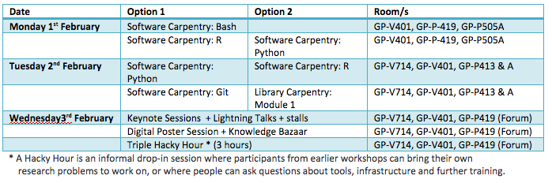

# Writing a Proposal

*Below is an example of a proposal prepared by Stephanie Bradbury for ResBaz Brisbane*

**Proposal:** ResBaz Event

**Prepared by** ………………………………….. 27 November 2015 

### **What is ResBaz?**

The Research Bazaar (ResBaz) is a free-of-charge, three-day intensive conference where researchers from all career stages (Masters, PhD, Post-Docs, ECRs) come together to up-skill in ‘next generation digital research tools and skills’! The goal is to equip researchers with skills and networks to help them do their research faster, better, smarter. 

The first Australian ResBaz was held at The University of Melbourne in February 2015. There were more than 150 attendees from over 40 different institutions around both Australia & New Zealand. From Biomedicine to Physical Sciences, Engineering to Humanities, the Research Bazaar brought in a diverse range of researchers who were split into 6 streams depending on what tool they registered to learn: R-stat, Python, MATLAB, NLTK, mapping and CAD. 

Most researchers are not taught how to write, use, validate, or share software well. Many spend hours or days doing things inefficiently. The ResBaz goal is to equip researchers with skills so that they can spend less time wrestling with software and more time doing useful research. The skills taught in ResBaz are not currently offered in standard research training.  

### Brisbane ResBaz 

**Dates**: 		Monday 1st February – Wednesday 3rd February, 2016

**Location**: 	Science and Engineering Centre (P Block), Queensland University of Technology, Gardens Point.

ResBaz is about building a community of researchers. To help make it a multi-city event, Brisbane ResBaz is scheduled for the same time as Melbourne ResBaz, meaning more participation, more media, and a bigger community.  There are also sites at Auckland, Dunedin, Perth and Sydney. Griffith University Library and The University of Queensland (UQ) Library are collaborating with QUT to organise and deliver a great event. As a warmup for Brisbane ResBaz, a [Software Carpentry](http://www.software-carpentry.org/) instructor training course is being run 18-19 January at UQ by Aleksandra Pawlik ([Software Sustainability Institute](http://www.software.ac.uk/), UK) and Belinda Weaver ([QCIF](http://www.qcif.edu.au/)). The new instructors trained there will then go on to teach Software Carpentry sessions at ResBaz. 

Workshops at the ResBaz conference are inspired by the highly successful challenge-based learning approach championed by Software Carpentry, which began in 1998. Various learning styles are employed including team-coding and peer to peer teaching, where ‘researcher to researcher’ is absolutely key to strong engagement and successful learning.

ResBaz is a low-cost, externally offered event for the research community.  It is supported by in-kind contribution of staff (Library, High Performance Computing, QCIF) to promote and run it.   A [“ResBaz Cookbook”](https://www.gitbook.com/book/heydejan/resbaz-cookbook/details), an open “how to run a ResBaz” document, was developed in 2015, upon which each new site can stamp their own flavour.

### Benefits

ResBaz creates opportunities and a space for interdisciplinary collaboration and mentorship. Community engagement is the core of ResBaz. As well as promoting open, reproducible research and providing access to increasingly complex digital skills to as many researchers as possible, ResBaz fosters an inclusive social environment for researchers from diverse backgrounds to learn with and from each other. 

### Schedule

The ResBaz formula consists of short, intensive workshops that develop skills such as computational competence. The Brisbane ResBaz proposal is to offer streams similar to what was offered in the 2015 Melbourne ResBaz: Programming and Data Analysis Using Python and Programming and Data Analysis Using R.

ResBaz provides training in a range of tools (http://melbourne.resbaz.edu.au/tools). Training is provided by RezBaz volunteers. Library Research Support Team and HPC staff will also be available to offer electives that could include Social Media for Research; ‘Get an ORCID’; Managing Research Data or Where to Publish and What to Consider; Introduction to 3D Printing; and NeCTAR Cloud.  

It is proposed that ResBaz will provide a digital toolbox poster session, a knowledge bazaar and social activities. A website is now open where trainers and attendees can [suggest an activity](http://bit.ly/1QKUL2d ), or volunteer to help in some way.

On completion of ResBaz sessions, attendees will not be experts in these tools, but they will be over the initial hurdle of learning complex programming languages, be able to do their research more efficiently, be familiar with terminology, and be able to start taking advantage of online resources that often assume a certain level of background knowledge.

### **Attendees**

ResBaz is not just for science and IT researchers; diversity in faculties, disciplines, subjects, research topics is encouraged. Past ResBazes have had good attendance from researchers across the full spectrum of disciplines. Brisbane ResBaz is expected to attract 60-100 attendees from all universities in Queensland and will be aimed at the following groups: Early Career Researchers; Higher Degree Research students; Academic researchers; Librarians; Data scientists; IT staff; Technical support staff; Research software developers.

### Registration

ResBaz has a set registration process for all attendees: 
1. Brisbane ResBaz draft site is live at https://feb2016.resbaz.com/brisbane/.  More events will be added over time.   
2. Attendees complete a “Pre-Assessment Survey” (we call it the Global Survey) to give trainers and ResBaz an indication of their current skills and interests.
3. Once completed, attendees receive a code which is entered into the “Local Site Registration form". This form will be available shortly. 

### **Promotion**
### 

Brisbane ResBaz will be promoted to:
- QUT researchers and Higher Degree Research students via the Research Students Centre and Office of Research
- Other Queensland researchers and research students via QULOC research support working party members
- QCIF - software carpentry waiting lists

### Catering

- Sponsorship will be sought to cover catering costs for lunch from the libraries of the collaborating institutions. Contributions of $500 from each of the three institutions will cover light catering for lunch.
- Sponsorship will be sought for morning tea.

### ResBaz Coordinating Group

- Belinda Weaver, QCIF
- Stephanie Bradbury, Library, QUT 
- Lance Wilson, High Performance Computing and Research Support, QUT
- Amanda Miotto, eResearch Support, Griffith University
- Heidi Perrett, eResearch Support, Griffith University
- Bill Beach, The University of Queensland Library
- Sam Hames, PhD student, The University of Queensland

### Contact

Stephanie Bradbury - s.bradbury@qut.edu.au - (3138 0618) 
